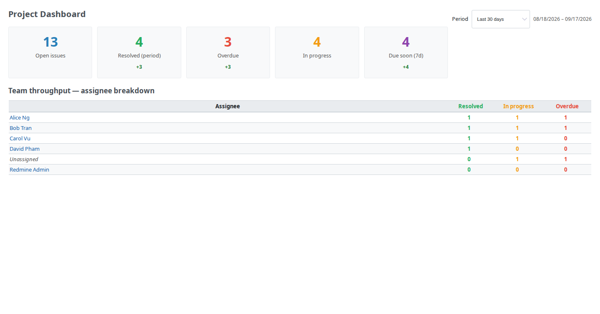

# Redmine Custom Dashboard

[](https://redmineshop.com/products/redmine-custom-dashboard)
[](LICENSE)

**Last maintained:** 2026-09-17

**Source on GitHub:** [github.com/redmineshop/redmine_custom_dashboard](https://github.com/redmineshop/redmine_custom_dashboard)

Employee performance dashboard for Redmine — KPI cards and assignee throughput per project, with a date-range filter. Built for team leads who need a quick view without exporting spreadsheets.

Community edition is **free forever** — no license key, no phone-home, **no email to clone**.

## Features

- Per-project **Dashboard** tab (enable the module on each project)
- KPI cards from live issue data: open / resolved (period) / overdue / in progress / due soon (7d)
- Click a KPI to open the matching filtered issues list
- Delta vs previous period (resolved) or period start (stock KPIs)
- Period filter: last 7, 30, or 90 days + visible date range
- Assignee breakdown with **Unassigned** row when relevant
- Permission: `view_custom_dashboard`
- No database tables — no plugin migration required
- English + Vietnamese UI strings

## Requirements

- Redmine 5.0.x or 6.x (`requires_redmine version_or_higher: '5.0'`)
- Ruby 3.0+
- MySQL 8 or PostgreSQL

## Installation

**Estimated time: 5–10 minutes.**

Clone into `plugins/redmine_custom_dashboard` in your Redmine install (folder name must match):

```bash
cd /path/to/redmine/plugins
git clone https://github.com/redmineshop/redmine_custom_dashboard.git
ls redmine_custom_dashboard/init.rb
```

Do not rename the plugin directory. If you download a GitHub ZIP, rename the unpacked `redmine_custom_dashboard-main` folder to `redmine_custom_dashboard`.

This plugin does not add database tables. Restart Redmine:

```bash
# systemd example
sudo systemctl restart redmine
```

Docker:

```bash
docker restart YOUR_REDMINE_CONTAINER
```

No extra gems. See the [install guide](https://redmineshop.com/docs/custom-dashboard-install).

### Enable module and permission

1. **Administration → Roles and permissions** — grant **View custom dashboard**
2. Per project: **Settings → Modules → Custom Dashboard**

There is no Administration → Plugins → Configure screen.

## Uninstall

Remove the plugin folder and restart Redmine. No `plugins:migrate VERSION=0` step is required.

## Compatibility

| Redmine | Ruby | Database | Status |
|---------|------|----------|--------|
| 6.x     | 3.2+ | MySQL 8 / PostgreSQL | Targeted — **untested** (no published QA matrix) |
| 5.1.x   | 3.1+ | MySQL 8 / PostgreSQL | Targeted — **untested** |
| 5.0.x   | 3.0+ | MySQL 8 / PostgreSQL | Targeted — **untested** |

The plugin declares `requires_redmine version_or_higher: '5.0'`. Do not treat catalog versions as tested cells. The demo quality harness is **one** Redmine image, not a 5.1 / 6.x matrix.

## Screenshot

Project Dashboard on demo Redmine (plugin quality harness):



KPI cards, assignee breakdown, overdue drill-down, and plugin row: [screenshots/kpi-cards.png](screenshots/kpi-cards.png), [screenshots/assignee-breakdown.png](screenshots/assignee-breakdown.png), [screenshots/kpi-drilldown-overdue.png](screenshots/kpi-drilldown-overdue.png), [screenshots/admin-plugins.png](screenshots/admin-plugins.png).

Refresh from the RedmineShop monorepo: `./demo/scripts/run-plugin-e2e.sh`.

## Tests

Unit + functional tests live under `test/` (MiniTest):

```bash
bundle exec rake redmine:plugins:test NAME=redmine_custom_dashboard RAILS_ENV=test
```

On the RedmineShop demo stack:

```bash
PLUGIN_NAME=redmine_custom_dashboard ./demo/scripts/run-sso-plugin-tests.sh
```

Public sibling CI (`.github/workflows/ci.yml`) is Ruby syntax only (`ruby -c`). That is not the quality bar.

### Quality harness (demo + E2E)

The quality harness lives on the RedmineShop **monorepo** demo stack (`docker-compose.demo.yml`). This public GitHub repo is the plugin only — it does not ship that compose file.

| Bar | Status |
| --- | --- |
| Automated tests beyond `ruby -c` | **Verified** — `test/unit` + `test/functional` in this repo (Playwright is a separate row) |
| Installed + enabled on demo Redmine | **Verified** — mounted via `demo/plugins/` on the monorepo demo stack; seed enables the module, grants `view_custom_dashboard`, and seeds KPI issues on `plugin-qa` |
| E2E primary happy path | **Verified** — Playwright `demo/e2e/tests/redmine_custom_dashboard.spec.js` (Dashboard tab, KPI cards, 7 vs 30 day period, overdue drill-down) |
| UI screenshot in README | **Verified** — `screenshots/{admin-plugins,dashboard-overview,kpi-cards,assignee-breakdown,kpi-drilldown-overdue}.png` from that spec |
| Redmine 5.1 / 6.x matrix | **Declared / untested** — this harness is one demo image, not a QA matrix |

How to run (monorepo, not this public repo): [plugin quality harness](https://github.com/redmineshop/redmineshop/blob/main/docs/plugin-quality-harness.md).

## Community support

Async only: [GitHub issues](https://github.com/redmineshop/redmine_custom_dashboard/issues) or the [support form](https://redmineshop.com/support). No 24/7 SLA.

## License

MIT License. See [LICENSE](LICENSE). No email required to get the plugin.
