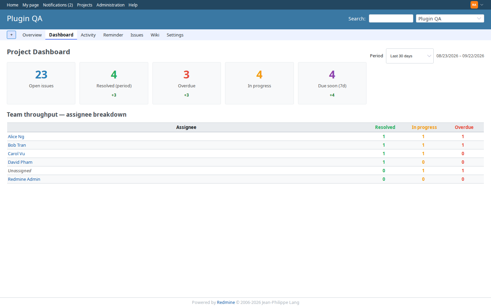
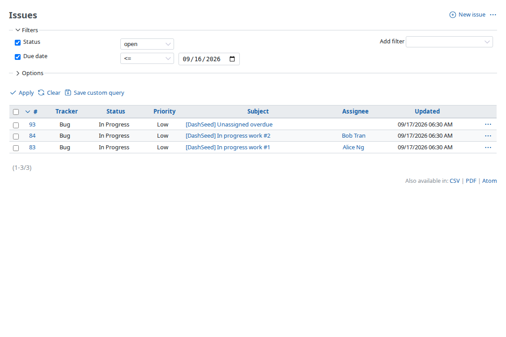

# Redmine Custom Dashboard

[](https://redmineshop.com/products/redmine-custom-dashboard)
[](LICENSE)
[](https://github.com/redmineshop/redmine_custom_dashboard/actions/workflows/ci.yml)

**Last maintained:** 2026-09-22

**Source on GitHub:** [github.com/redmineshop/redmine_custom_dashboard](https://github.com/redmineshop/redmine_custom_dashboard)

Live project KPIs for Redmine.

Employee performance dashboard for Redmine — KPI cards and assignee throughput per project, with a date-range filter. Built for team leads who need a quick view without exporting spreadsheets.

Community edition is free — no license key and no phone-home. Clone from this repository.

## Features

- Per-project **Dashboard** tab (enable the module on each project)
- KPI cards from live issue data: open / resolved (period) / overdue / in progress / due soon (7d)
- Click a KPI to open the matching filtered issues list
- Delta vs previous period (resolved) or period start (stock KPIs)
- Period filter: last 7, 30, or 90 days + visible date range
- Assignee breakdown with **Unassigned** row when relevant
- Permission: `view_custom_dashboard`
- No database tables — no plugin migration required
- English + Vietnamese UI strings

## Requirements

- Redmine 5.0.x or 6.x (`requires_redmine version_or_higher: '5.0'`)
- Ruby 3.0+
- MySQL 8 or PostgreSQL

## Installation

**Estimated time: 5–10 minutes.**

Clone into `plugins/redmine_custom_dashboard` in your Redmine install (folder name must match):

```bash
cd /path/to/redmine/plugins
git clone https://github.com/redmineshop/redmine_custom_dashboard.git
ls redmine_custom_dashboard/init.rb
```

Do not rename the plugin directory. If you download a GitHub ZIP, rename the unpacked `redmine_custom_dashboard-main` folder to `redmine_custom_dashboard`.

This plugin does not add database tables. Restart Redmine:

```bash
# systemd example
sudo systemctl restart redmine
```

Docker:

```bash
docker restart YOUR_REDMINE_CONTAINER
```

No extra gems. See the [install guide](https://redmineshop.com/docs/custom-dashboard-install).

### Enable module and permission

1. **Administration → Roles and permissions** — grant **View custom dashboard**
2. Per project: **Settings → Modules → Custom Dashboard**

There is no Administration → Plugins → Configure screen. After restart, **Administration → Plugins** lists **Redmine Custom Dashboard**.

## Uninstall

Remove the plugin folder and restart Redmine. No `plugins:migrate VERSION=0` step is required.

## Compatibility

Declared follows `requires_redmine version_or_higher: '5.0'` for 5.x and 6.x. Redmine 7.0 is not a claimed target. Tested means a run pinned to that Redmine line. The demo image is official `redmine:latest` (tag not pinned), so a demo boot is not a pass for a specific row.

| Redmine | Declared | Tested |
|---------|----------|--------|
| 5.0.x   | Yes      | No — unverified |
| 5.1.x   | Yes      | No — unverified |
| 6.0.x   | Yes      | No — unverified |
| 6.1.x   | Yes      | No — unverified |
| 7.0.x   | No       | No — unverified |

## Screenshot

Project Dashboard, KPI cards, assignee breakdown, overdue drill-down, and the plugin row (demo Redmine):







Images are crops from a demo Redmine. The Redmine version in the capture was not recorded. `kpi-cards.png` is a short crop of the cards. A full-page screenshot is still TODO.

## Tests

Unit + functional tests live under `test/` (MiniTest):

```bash
bundle exec rake redmine:plugins:test NAME=redmine_custom_dashboard RAILS_ENV=test
```

Public GitHub Actions (`.github/workflows/ci.yml`) runs Ruby syntax checks only (`ruby -c`).

## Limits

- One project at a time. There is no cross-project or administration-wide dashboard.
- No database tables and no **Administration → Plugins → Configure** screen. Enable the module per project and grant **View custom dashboard**.
- MiniTest does not boot Redmine 5.0, 5.1, 6.0, 6.1, or 7.0.
- Install notes: [custom dashboard install](https://redmineshop.com/docs/custom-dashboard-install).

## Community support

Async only: [GitHub issues](https://github.com/redmineshop/redmine_custom_dashboard/issues) or the [support form](https://redmineshop.com/support). No 24/7 SLA.

## License

MIT License. See [LICENSE](LICENSE). No email required to get the plugin.
