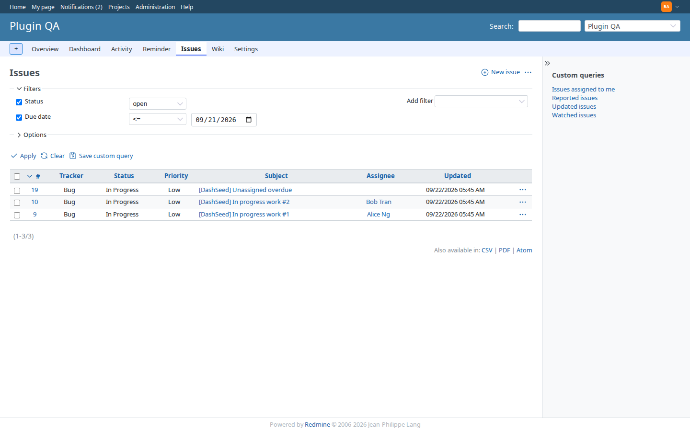

# Redmine Custom Dashboard

[](https://redmineshop.com/products/redmine-custom-dashboard)
[](LICENSE)
[](https://github.com/redmineshop/redmine_custom_dashboard/actions/workflows/ci.yml)

**Last maintained:** 2026-10-06

**Source on GitHub:** [github.com/redmineshop/redmine_custom_dashboard](https://github.com/redmineshop/redmine_custom_dashboard)

Employee performance dashboard for Redmine — KPI cards and assignee throughput per project, with a date-range filter. Built for team leads who need a quick view without exporting spreadsheets.

Community edition is **free forever** — no license key, no phone-home, **no email to clone**.

## Features

- Per-project **Dashboard** tab (enable the module on each project)
- KPI cards from live issue data: open / resolved (period) / overdue / in progress / due soon (7d)
- In progress counts open issues whose status name matches Redmine's default in-progress label: `In Progress`, `Đang thực hiện`, and `default_issue_status_in_progress` from locales installed with Redmine (case-insensitive). A custom status name that does not match those labels is not counted. A closed status is not counted.
- Click a KPI to open the matching filtered issues list
- Delta vs previous period (resolved) or period start (stock KPIs)
- Period filter: last 7, 30, or 90 days + visible date range
- Assignee breakdown with **Unassigned** row when relevant
- Permission: `view_custom_dashboard`
- No database tables — no plugin migration required
- English + Vietnamese UI strings

## Requirements

- Redmine 5.0 or newer (`requires_redmine version_or_higher: '5.0'`). Public CI runs Redmine 7.0.1
- Ruby 3.0+ is declared. Public CI uses Ruby 3.2
- MySQL 8 or PostgreSQL. Public CI uses MySQL 8.0. PostgreSQL was not run

## Installation

**Estimated time: 5–10 minutes.**

Clone into `plugins/redmine_custom_dashboard` in your Redmine install (folder name must match):

```bash
cd /path/to/redmine/plugins
git clone https://github.com/redmineshop/redmine_custom_dashboard.git
ls redmine_custom_dashboard/init.rb
```

Do not rename the plugin directory. If you download a GitHub ZIP, rename the unpacked `redmine_custom_dashboard-main` folder to `redmine_custom_dashboard`.

This plugin does not add database tables. Restart Redmine:

```bash
# systemd example
sudo systemctl restart redmine
```

Docker:

```bash
docker restart YOUR_REDMINE_CONTAINER
```

No extra gems. See the [install guide](https://redmineshop.com/docs/custom-dashboard-install).

### Enable module and permission

1. **Administration → Roles and permissions** — grant **View custom dashboard**
2. Per project: **Settings → Modules → Custom Dashboard**

There is no Administration → Plugins → Configure screen.

## Uninstall

Remove the plugin folder and restart Redmine. No `plugins:migrate VERSION=0` step is required.

## Compatibility

| Redmine | Ruby | Database | Status |
|---------|------|----------|--------|
| 7.0.1   | 3.2 | MySQL 8.0.46 | **Verified** — public CI checks out Redmine 7.0.1 (Rails 8.1.3.1), installs this plugin, runs migrations, and runs MiniTest: 37 runs, 256 assertions, 0 failures, 0 errors, 0 skips |
| 6.x     | 3.2+ | MySQL 8 / PostgreSQL | Declared — **untested** |
| 5.1.x   | 3.1+ | MySQL 8 / PostgreSQL | Declared — **untested** |
| 5.0.x   | 3.0+ | MySQL 8 / PostgreSQL | Declared — **untested** |

The plugin declares `requires_redmine version_or_higher: '5.0'`. Only the 7.0.1 / MySQL 8.0.46 / Ruby 3.2 cell was run. PostgreSQL was not run. Other 7.0 patch releases were not run. Do not treat the 5.x and 6.x rows as tested.

## Screenshot

Project → Dashboard on demo Redmine. The KPI cards (including Due soon) sit in the project page with the top menu and project tabs. The assignee table on that page includes Unassigned.


The Overdue card opens the filtered issue list:




These screenshots were not regenerated for the public CI job.

## Tests

MiniTest lives under `test/`. It covers:

- KPI counts: open, resolved in the period, overdue, in progress, and due soon
- Period windows of 7, 30, and 90 days, including the rendered 7 vs 30 day counts
- Project isolation: other projects, subprojects, and private projects
- Private issues hidden from a viewer who cannot open them, and still counted for a viewer who can
- Permission denial, a disabled Custom Dashboard module, a missing project, and anonymous redirect
- Drill-down links stay on this project and use Redmine's supported issue-query operators
- Period values outside `7`, `30`, and `90` are not interpolated into SQL
- Assignee names are HTML-escaped
- Only `GET` index is routed, and the page does not create or update records

Public CI (`.github/workflows/ci.yml`) has two jobs:

- Ruby syntax (`ruby -c`) and `test/standalone/dashboard_stats_standalone_test.rb` on Ruby 3.2 and 3.3. That job does not boot Redmine.
- Redmine 7.0.1 with a MySQL 8.0.46 service. The job checks the plugin out into `plugins/redmine_custom_dashboard`, runs `db:migrate` and `redmine:plugins:migrate`, then `rake redmine:plugins:test NAME=redmine_custom_dashboard`.

On 2026-10-06 that MiniTest job passed on Redmine 7.0.1, Ruby 3.2.3, Rails 8.1.3.1, MySQL 8.0.46:

```text
37 runs, 256 assertions, 0 failures, 0 errors, 0 skips
```

On a Redmine install that already has this plugin:

```bash
bundle exec rake redmine:plugins:test NAME=redmine_custom_dashboard RAILS_ENV=test
```

This plugin does not add tables. `redmine:plugins:migrate` is still run in CI and does nothing.

This repository does not include a browser end-to-end run. Playwright last ran on 2026-09-23 (Dashboard tab, KPI cards, 7 vs 30 day period, overdue drill-down). That run was not repeated. Install the plugin on your own Redmine with the steps in [Installation](#installation). Notes: [custom dashboard install](https://redmineshop.com/docs/custom-dashboard-install).

| Bar | Status |
| --- | --- |
| MiniTest on Redmine 7.0.1 + MySQL 8 | **Verified** — public CI, Ruby 3.2.3, Rails 8.1.3.1, MySQL 8.0.46: 37 runs, 256 assertions, 0 failures, 0 errors, 0 skips |
| Redmine 5.x / 6.x | **Declared / untested** |
| PostgreSQL | **Not run** |
| Playwright / browser end-to-end | **Not in this repository.** Last run 2026-09-23. Not run again for this CI job |
| README screenshots | **Present** — `screenshots/kpi-cards.png`, `screenshots/kpi-drilldown.png`, and `screenshots/admin-plugins.png`. Not regenerated for the public CI job. `dashboard-overview.png` and `assignee-breakdown.png` are the same image as `kpi-cards.png`. `kpi-drilldown-overdue.png` is the same image as `kpi-drilldown.png` |
| Live demo install | **Not re-checked** for this CI job |

## Community support

Async only: [GitHub issues](https://github.com/redmineshop/redmine_custom_dashboard/issues) or the [support form](https://redmineshop.com/support). No 24/7 SLA.

## License

MIT License. See [LICENSE](LICENSE). No email required to get the plugin.
